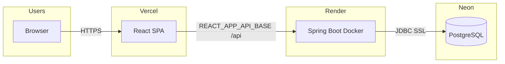
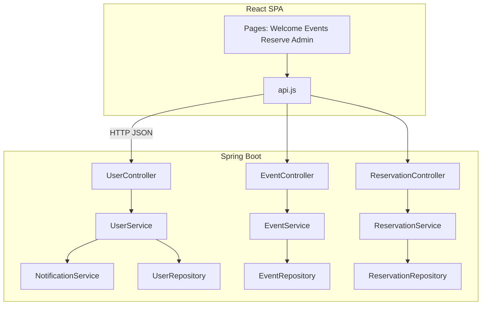

# System architecture

## 1. High-level overview

MakeSoft is a **three-tier, cloud-hosted** ticket reservation system:

- **Presentation:** React (SPA) on **Vercel**
- **Application:** Spring Boot REST API on **Render** (Docker)
- **Data:** PostgreSQL on **Neon**

The browser talks only to the REST API over HTTPS; the API enforces business rules and persists data via JPA.

## 2. Logical architecture (layers)

| Layer | Responsibility | Technology |
|-------|----------------|------------|
| **Client** | UI, routing, API calls | React, React Router |
| **API / Controller** | HTTP, validation, status codes, CORS | Spring `@RestController` |
| **Service** | Business logic (events, users, reservations, notifications) | Spring `@Service` |
| **Repository** | Persistence, queries | Spring Data JPA |
| **Database** | Relational storage | PostgreSQL (Neon) |

**Request flow:** `Browser → REST Controller → Service → Repository → Database`, then response back through the same stack.

## 3. Deployment architecture

**Notes for the report:**

- **Frontend URL:** `Vercel` app (e.g. `*.vercel.app`).
- **Backend URL:** `Render` web service (e.g. `*.onrender.com`).
- **Environment:** `REACT_APP_API_BASE` points to `https://<backend>/api`. CORS on controllers allows `localhost` and `https://*.vercel.app`.

**Non-functional:** Free tiers may **cold-start** the backend; the app mitigates this with retries and a wake-up request on load (document in NFR / testing).

## 4. Component diagram (application)

## 5. Security & integration (high level)

- **Authentication:** Sessionless; client stores user info after login (as implemented in the project). *State explicitly in the report if this is course-only; production would use JWT/OAuth2.*
- **HTTPS:** Enforced by Vercel and Render frontends.
- **Database:** Credentials via environment variables on Render; not committed to public repos.

---

**Screenshot suggestions for the report:** Vercel project settings, Render service dashboard, Neon connection string (redact password), and a browser network tab showing `GET /api/events` → 200.
