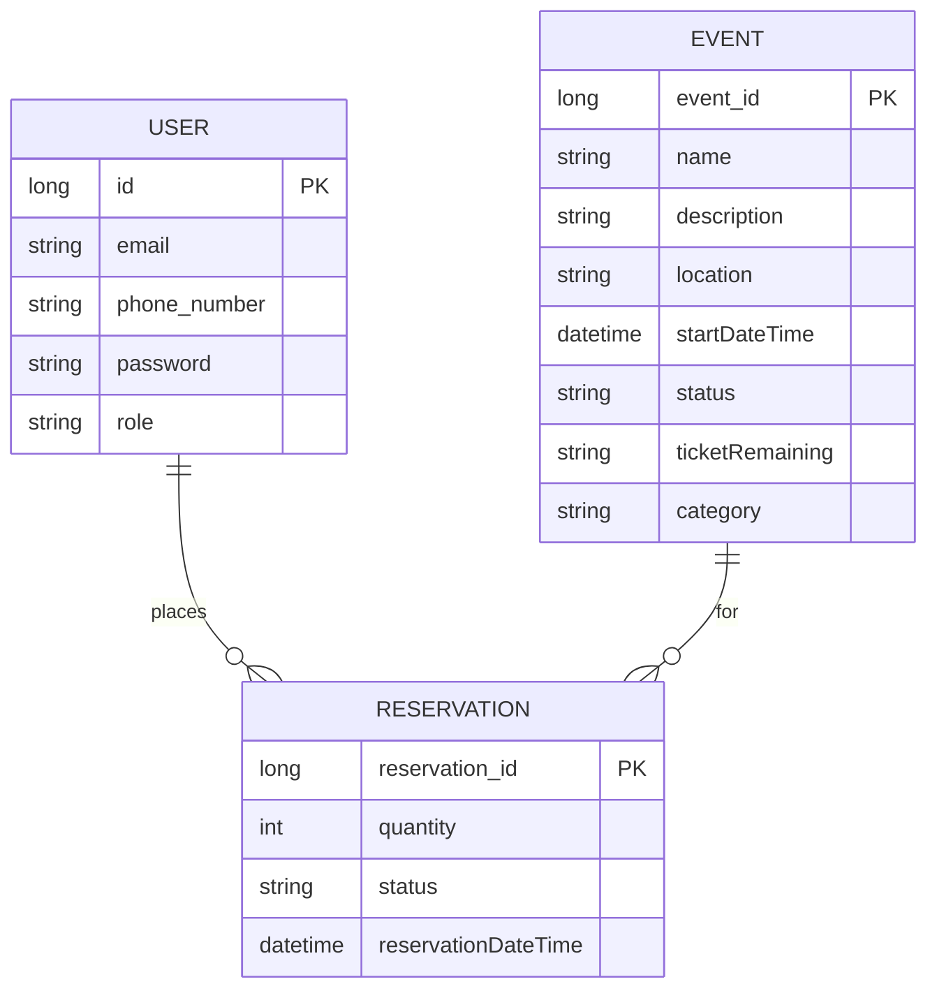

# Database design

## 1. Overview

The application uses **PostgreSQL** (hosted on Neon in production) with **Spring Data JPA** and `ddl-auto` appropriate for the environment (e.g. `update` in dev/prod as configured). Tests use **H2 in-memory** with PostgreSQL compatibility mode.

## 2. Entities (conceptual)

| Entity | Key fields | Relationships |
|--------|------------|---------------|
| **User** | `id`, email, phone, password, role | One user has many **Reservation**s |
| **Event** | `id`, name, description, location, `startDateTime`, status, `ticketRemaining`, category | One event has many **Reservation**s |
| **Reservation** | `reservation_id`, quantity, status, reservation date/time | Many-to-one to **User** and **Event** |

*Adjust column names to match your actual JPA entities (`@Column` names) when you paste into the report.*

## 3. ER diagram (conceptual)

## 4. Design decisions (for “justification” in the report)

- **Normalization:** Users, events, and reservations are separate tables to avoid duplication and support referential integrity.
- **Status fields:** Event `status` (e.g. `AVAILABLE`, `FILLED`, `PASSED`) supports business rules (sold out, past events).
- **Ticket count:** Stored as string or numeric in DB as per entity; business logic enforces decrements on reservation.

## 5. Screenshot / tool suggestions

- Export **ERD** from Neon console if available, or use the Mermaid diagram above.
- Include **one screenshot** of a table view or SQL panel (with sensitive data redacted).
