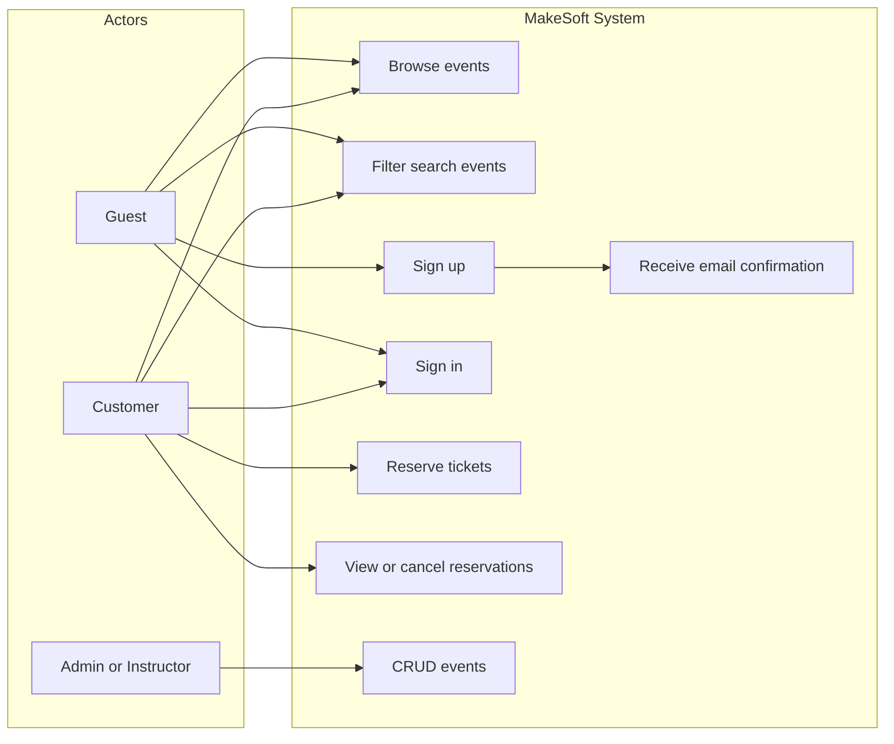
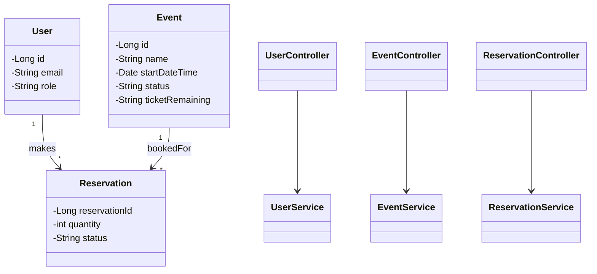
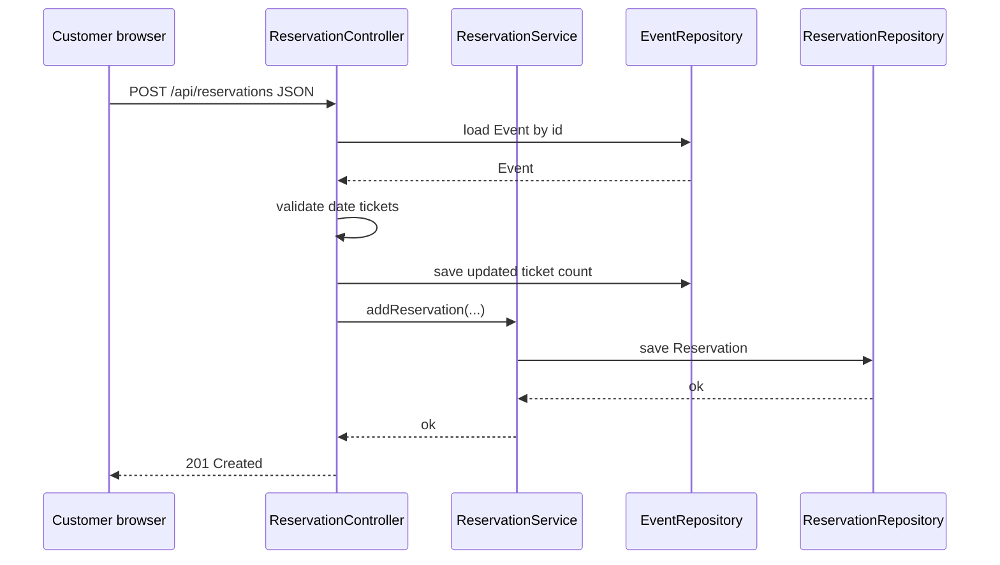
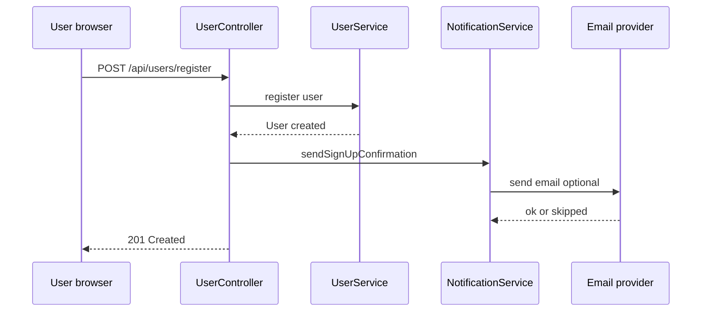

# UML diagrams (MakeSoft)

Render these with **Mermaid** ([mermaid.live](https://mermaid.live)) or a VS Code extension, then **export to PNG/SVG** for the report.

---

## 1. Use case diagram

High-level actors: **Guest**, **Customer**, **Admin/Instructor**, **System** (email).

*For a classic UML use case oval diagram, redraw in Draw.io / Lucidchart using the same use cases.*

---

## 2. Class diagram (simplified domain + API)

Focus on main domain classes and controllers (adjust names to match your packages).

---

## 3. Sequence diagram — Reserve tickets (happy path)

---

## 4. Sequence diagram — Sign up + confirmation email

---

**Report tip:** Add **one paragraph** under each figure explaining what the diagram shows and how it supports the requirements.
